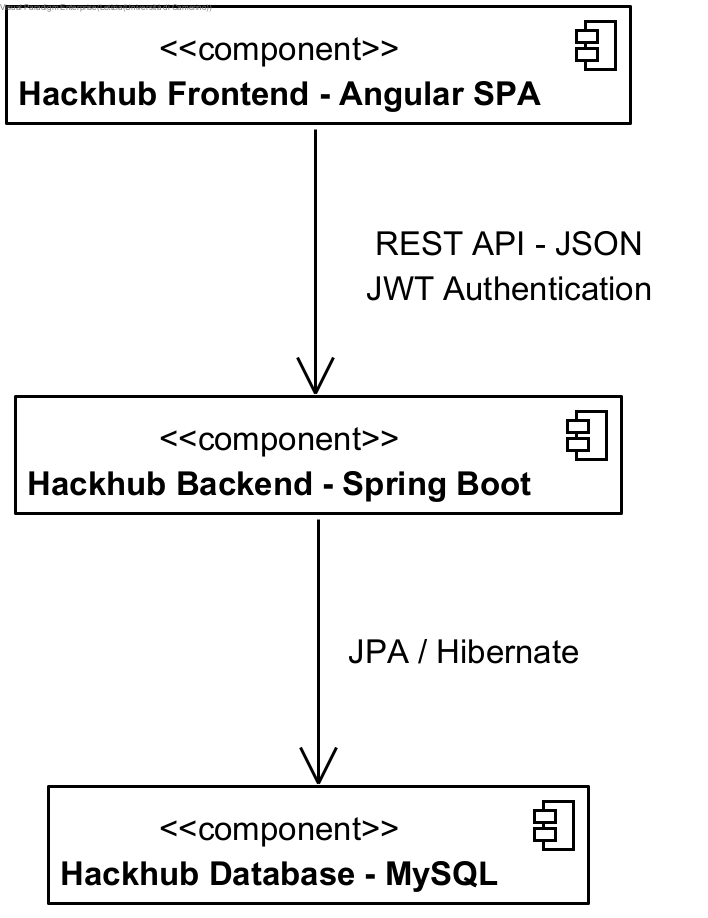
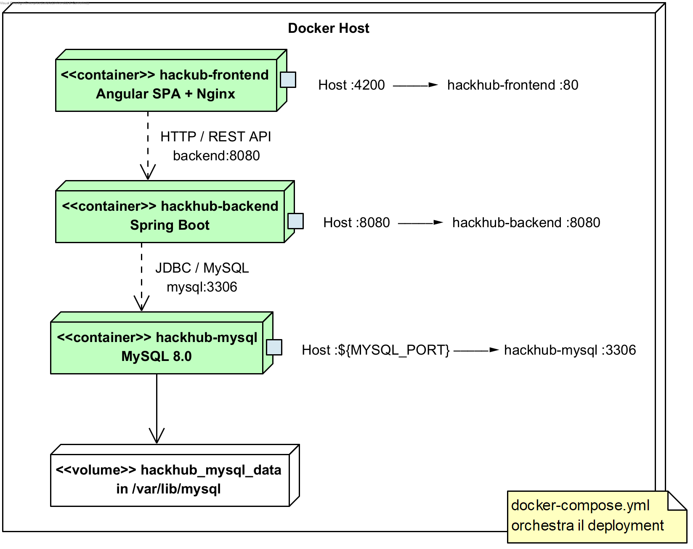

# HackHub

HackHub è una piattaforma web per la gestione di hackathon, realizzata per gli esami di **Ingegneria del Software** e **Applicazioni Web, Mobile e Cloud** dell'Università di Camerino.

Il progetto permette di organizzare eventi, gestire i team partecipanti e seguire le attività fino alla valutazione dei progetti. L'applicazione è composta da un frontend Angular, un backend Spring Boot e un database MySQL.

## Funzionalità principali

- Registrazione e accesso degli utenti.
- Consultazione degli hackathon, con dettagli, stato e posti disponibili.
- Creazione degli hackathon, definendo date, regolamento, premio e dimensione dei team.
- Gestione dei team, dei membri e delle iscrizioni agli eventi.
- Invio e rimozione delle sottomissioni tramite un link al progetto.
- Valutazione delle sottomissioni da parte dei giudici e proclamazione del vincitore.
- Inviti allo staff, richieste di assistenza ai mentori, proposte di call e notifiche.
- Gestione automatica delle fasi dell'hackathon in base alle scadenze.

L'interfaccia Angular comprende autenticazione, consultazione e creazione degli hackathon, iscrizione del proprio team e pagina account. Alcune operazioni di gestione sono disponibili solo tramite API.

## Tecnologie utilizzate

| Parte del progetto | Tecnologie |
| --- | --- |
| Frontend | Angular 21, TypeScript, RxJS, Bootstrap e SCSS |
| Backend | Java 21, Spring Boot 4, Spring Security e JWT |
| Database | MySQL 8, Spring Data JPA e Hibernate |
| Avvio e compilazione | Docker, Docker Compose, nginx, Gradle e npm |
| Test | JUnit, MockMvc e H2 per il backend; Vitest e Angular TestBed per il frontend |

## Architettura

Il flusso principale è **frontend Angular → backend Spring Boot → database MySQL**.

Angular gestisce le pagine e le interazioni con l'utente nel browser. Comunica con il backend attraverso richieste HTTP alle API REST, sotto il percorso `/api`. Spring Boot gestisce la logica dell'applicazione e accede al database tramite Spring Data JPA e Hibernate.

Nel backend il codice è suddiviso tra controller e DTO (`boundary`), logica dei casi d'uso (`handler`), entità e regole del dominio (`domain`), accesso ai dati (`repository`) e servizi condivisi (`servizi`).

## Struttura del repository

```text
hackhub/
  README.md
  backend/
    src/main/          Codice Java e configurazione Spring Boot
    src/test/          Test del backend
    diagrammi/         Diagrammi UML e documenti di analisi
    .env.example       Esempio delle variabili di configurazione
    docker-compose.yml
    Dockerfile
    build.gradle
  frontend/
    src/               Pagine, componenti e servizi Angular
    angular.json
    package.json
    nginx.conf
    Dockerfile
```

## Docker e Docker Compose

Il progetto utilizza tre container:

- **MySQL** contiene il database. I dati vengono conservati in un volume Docker anche dopo l'arresto dei container.
- **Spring Boot** espone le API del backend sulla porta `8080`.
- **Frontend con nginx** contiene l'applicazione Angular compilata. nginx serve le pagine e inoltra le richieste `/api` al backend.

Docker Compose avvia e collega i tre servizi. Il backend attende che il database sia pronto e il frontend attende il backend. La configurazione si trova in [backend/docker-compose.yml](backend/docker-compose.yml).

Si tratta di un ambiente locale eseguibile con Docker; non è configurato un deployment su un provider cloud.

## Configurazione e avvio

Per avviare l'intera applicazione servono Docker e Docker Compose, con Docker in esecuzione. Al primo avvio è necessaria una connessione a Internet per scaricare immagini e dipendenze. Non occorre installare Java o Node.js sul computer se si usa questa modalità.

### 1. Preparare il file `.env`

Dalla cartella principale del progetto, entrare in `backend` e copiare il file di esempio, se non è già presente una configurazione personale:

```bash
cd backend
cp .env.example .env
```

Su Windows PowerShell si può usare `Copy-Item .env.example .env`.

Nel file `.env`:

- Impostare nome del database, utente e password nelle variabili `MYSQL_DATABASE`, `MYSQL_USER`, `MYSQL_PASSWORD` e `MYSQL_ROOT_PASSWORD`.
- Far corrispondere `DB_NAME` a `MYSQL_DATABASE`, `DB_USERNAME` a `MYSQL_USER` e `DB_PASSWORD` a `MYSQL_PASSWORD`.
- Sostituire `APP_JWT_SECRET` con una chiave casuale di almeno 32 caratteri ASCII. `APP_JWT_EXPIRATION_MS` indica la durata del token: il valore di esempio corrisponde a un'ora.
- Per l'avvio con Docker, impostare:

```properties
DB_HOST=mysql
DB_PORT=3306
SERVER_PORT=8080
```

 `MYSQL_PORT` indica invece la porta con cui accedere al database dal computer ed è impostata a `3306` nell'esempio.

Il file `.env` contiene credenziali personali e non deve essere aggiunto al repository.

### 2. Avviare l'applicazione

Dalla cartella `backend`:

```bash
docker compose up --build
```

Al termine dell'avvio sono disponibili:

| Servizio | Indirizzo |
| --- | --- |
| Applicazione web | [http://localhost:4200](http://localhost:4200) |
| API del backend | [http://localhost:8080/api/hackathon](http://localhost:8080/api/hackathon) |
| Database MySQL | `localhost:3306`, oppure la porta scelta in `MYSQL_PORT` |

Per creare un hackathon servono anche gli account degli utenti da invitare come giudice e mentori.

### 3. Arrestare l'applicazione

Sempre dalla cartella `backend`:

```bash
docker compose down
```

Questo comando conserva i dati del database. L'opzione `-v` elimina anche il volume e va usata solo se si vuole cancellare i dati.

## Account demo

Copiando `backend/.env.example` in `.env`, `APP_DEMO_DATA_ENABLED=true` abilita la creazione automatica dei dati demo all'avvio del backend. **Queste credenziali sono esclusivamente locali/demo: non abilitarle in ambienti pubblici o di produzione.** Le password sono salvate con il `PasswordEncoder` BCrypt già configurato, mai in chiaro.

| Username | Password demo | Ruolo/funzione | Associazione |
| --- | --- | --- | --- |
| `leader1` | `Demo123!` | Leader del team | Team Alpha |
| `membro1` | `Demo123!` | Membro del team | Team Alpha |
| `membro2` | `Demo123!` | Membro del team | Team Alpha |
| `organizzatore1` | `Demo123!` | ORGANIZZATORE | HackHub Demo |
| `giudice1` | `Demo123!` | GIUDICE | HackHub Demo |
| `mentore1` | `Demo123!` | MENTORE | HackHub Demo |

I ruoli staff sono associati a **HackHub Demo**, non sono ruoli globali dell'utente. Gli inviti di giudice e mentore vengono creati e accettati tramite i casi d'uso esistenti.

Alla prima creazione, l'hackathon si svolge a Camerino da 30 a 32 giorni dopo l'avvio; le iscrizioni scadono 7 giorni prima dell'inizio alle 23:59. Ha iscrizioni aperte, premio dimostrativo di 1000 euro, team da 3 a 6 membri e un massimo di 10 team. **Team Alpha non è preiscritto**: accedere con `leader1`, aprire l'hackathon e iscrivere il team permette di provare subito il flusso. Sottomissioni, assistenza e valutazioni restano soggette alle normali fasi dell'evento.

I riavvii non duplicano utenti, team, hackathon, relazioni o inviti. Gli utenti sono identificati dallo username; team e hackathon dal nome. Le risorse già esistenti vengono lasciate inalterate, incluse password, ruoli, relazioni e date: le credenziali in tabella valgono per gli account creati dall'initializer. Eventuali appartenenze a team già presenti vengono rispettate e i conflitti segnalati nei log. Le date non vengono spostate ai riavvii e un evento già esistente non viene riaperto.

Per disabilitare l'inizializzazione, impostare `APP_DEMO_DATA_ENABLED=false` in `backend/.env` e, dalla cartella `backend`, eseguire `docker compose up -d --force-recreate backend`. Senza questa variabile il valore predefinito è `false`. Disabilitarla non elimina i dati già creati.

## Sviluppo locale

In alternativa a Docker per l'intera applicazione, frontend e backend possono essere avviati separatamente. Servono JDK 21, Node.js compatibile con Angular (ad esempio Node 22.12 o successivo della serie 22) e npm.

Dopo aver fermato lo stack completo, impostare `DB_HOST=localhost` e `DB_PORT` alla porta scelta in `MYSQL_PORT`. Dalla cartella `backend`, avviare solo MySQL con `docker compose up -d mysql`; quando è pronto, eseguire `./gradlew bootRun`.

Dalla cartella `frontend`, eseguire `npm ci` e poi `npm start`. Il proxy configurato in [src/proxy.conf.json](frontend/src/proxy.conf.json) inoltra le richieste API a `http://localhost:8080`, dove è in esecuzione il backend. Questo proxy viene usato nello sviluppo, mentre con Docker le richieste passano attraverso nginx.

Su Windows, usare `.\gradlew.bat` al posto di `./gradlew`. Prima di tornare all'avvio completo con Docker, ripristinare `DB_HOST=mysql` e `DB_PORT=3306`.

## Compilazione e test

### Backend

Dalla cartella `backend`, per creare il file JAR dell'applicazione senza eseguire i test:

```bash
./gradlew bootJar
```

Sono presenti test delle API con JUnit e MockMvc e test dell'autenticazione JWT. Il comando per eseguirli è `./gradlew test`; `./gradlew build` esegue sia la compilazione sia i test.

I test usano il database H2 in memoria configurato in `backend/src/test/resources/application.properties`, senza importare `.env` o accedere al MySQL della demo. I dati demo sono disattivati nei test ordinari e attivati esplicitamente nei test dell'initializer. I risultati vengono salvati in `backend/build/reports/tests/test/`.

### Frontend

Dalla cartella `frontend`, dopo aver installato le dipendenze con `npm ci`:

```bash
npm run build
npm test -- --watch=false
```

I test con Vitest verificano principalmente la creazione di componenti e servizi. Non sono configurati test end-to-end.

## Autenticazione e autorizzazioni

L'autenticazione usa **JWT**: dopo l'accesso il frontend invia il token nelle richieste alle API protette. Le password vengono salvate come hash con BCrypt.

La registrazione, l'accesso e la consultazione degli hackathon sono pubblici. Le altre operazioni richiedono l'autenticazione; il backend controlla i permessi in base al ruolo e all'appartenenza al team o allo staff dell'hackathon.

## CI/CD

Il progetto utilizza **GitHub Actions** per eseguire automaticamente una pipeline di Continuous Integration ad ogni push e pull request.

La pipeline contiene due job:

- **Backend**: configura Java 21 e compila l'applicazione Spring Boot tramite Gradle.
- **Frontend**: installa le dipendenze con `npm ci`, esegue i test Angular e verifica la build di produzione.

La configurazione della pipeline si trova in `.github/workflows/ci.yml`.

Il deployment tramite Docker Compose viene invece avviato manualmente.

## Diagrammi e documentazione

Nella cartella [backend/diagrammi](backend/diagrammi/) sono disponibili:

- [Progetto Visual Paradigm](backend/diagrammi/Progetto%20HackHub.vpp), con diagrammi delle classi, delle interazioni e dei casi d'uso.
- [Analisi degli attori e dei requisiti](backend/diagrammi/HACKHUB%20-%20Analisi.docx).
- [Analisi nome-verbo per il diagramma delle classi](backend/diagrammi/ANALISI%20NOME-VERBO%20PER%20CLASS%20DIAGRAM.docx).

Nella cartella [docs](docs/) sono disponibili anche il diagramma dell'architettura e il diagramma di deployment:





## Servizi esterni simulati

I servizi di calendario e pagamento sono rappresentati da `CalendarioMock` e `SistemaDiPagamentoMock`. Servono a rappresentare i casi d'uso delle call e del pagamento del premio, ma non creano eventi reali né effettuano trasferimenti di denaro.

Le notifiche sono salvate nel database e consultabili tramite API.

## Utilizzo di strumenti di AI

Sono stati utilizzati strumenti di AI-assisted development come supporto alla revisione del repository e alla preparazione di questo README. Le informazioni sono state confrontate con il codice; la responsabilità del progetto rimane degli autori.
